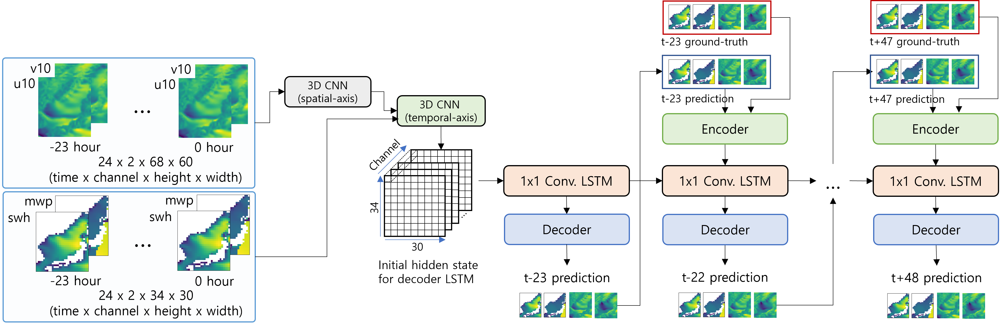

# KIOST-3D-VAR-DA
Physics-informed data assimilation-based spatiotemporal synthetic data generation



## Overview
This repository provides code and generated results for physics-informed spatiotemporal synthetic data generation using 3D-Var data assimilation and deep learning. The project focuses on reconstructing and generating ocean-related variables by combining numerical reanalysis data, in-situ observations, and model-based physical constraints.

The implementation combines two research directions:

* 3D-Var data assimilation for integrating observation data with background fields
* Physics-informed deep learning for spatiotemporal ocean data reconstruction
* A U-Net-based spatiotemporal model is used to generate synthetic ocean fields from wind and wave-related input variables

===

## Project directory structure
```
.
├── README.md
├── LICENSE
├── code/
│   └── [Project source code]
└── data/
    └── [Synthetic data]
```

## Project guideline
Any public project SHOULD include:
* MIT License @ `LICENSE`
* Acknowledgement @ `README.md`
* BibTeX citation + link to PDF file @ `README`, if the project is accompanied with a research paper

Any public project SHOULD NOT include:
* Private data, undisclosed data, data with limited accessibility
  - Preferably, *any* data should be hosted outside of the repository.
* Personal information
  - *Unintended* personal information of researchers and developers within source code
  - Device IP address, password, secrets, file path, ...

Any Public project is encouraged to include:
* Project pages (GitHub pages or other platform)
* Examples as Colab/Jupyter notebook


## Dataset

* ECMWF ERA5 (https://cds.climate.copernicus.eu/datasets)
* KMA Weather Data Service 'Open MET Data Portal' (https://data.kma.go.kr/data/sea/selectBuoyRltmList.do?pgmNo=52)
* Ministry of Oceans and Fisheries Data Service (http://wink.go.kr/main.do)

## Requirements

First, install PyTorch meeting your environment (at least 1.7):
```bash
pip install torch torchvision torchaudio --extra-index-url https://download.pytorch.org/whl/cu116
```

Then, use the following command to install the rest of the libraries:
```bash
pip install tqdm ninja h5py kornia matplotlib pandas sklearn scipy seaborn wandb PyYaml click requests pyspng imageio-ffmpeg timm
```

## Features

- **Model:** A variant of the U-Net architecture based on Google DeepMind’s MetNet-2, designed to process continuous inputs (ocean surface wind components u and v, significant wave height (SWH), and mean wave period (MWP)), extract features through contraction–expansion pathways, and encode temporal information for time-series data processing.

## Citation

```bibtex
@article{caires2018korean,
  title={Korean East Coast wave predictions by means of ensemble Kalman filter data assimilation},
  author={Caires, Sofia and Kim, Jinah and Groeneweg, Jacco},
  journal={Ocean Dynamics},
  volume={68},
  number={11},
  pages={1571--1592},
  year={2018},
  publisher={Springer}
}

@article{trok2024machine,
  title={Machine learning--based extreme event attribution},
  author={Trok, Jared T and Barnes, Elizabeth A and Davenport, Frances V and Diffenbaugh, Noah S},
  journal={Science Advances},
  volume={10},
  number={34},
  pages={eadl3242},
  year={2024},
  publisher={American Association for the Advancement of Science}
}

@article{espeholt2022deep,
  title={Deep learning for twelve hour precipitation forecasts},
  author={Espeholt, Lasse and Agrawal, Shreya and S{\o}nderby, Casper and Kumar, Manoj and Heek, Jonathan and Bromberg, Carla and Gazen, Cenk and Carver, Rob and Andrychowicz, Marcin and Hickey, Jason and others},
  journal={Nature communications},
  volume={13},
  number={1},
  pages={5145},
  year={2022},
  publisher={Nature Publishing Group UK London}
}

```

## Acknowledgement

###### Korean acknowledgement
> 이 논문은 2023년-2026년 정부(과학기술정보통신부)의 재원으로 정보통신기획평가원의 지원을 받아 수행된 연구임 (No.00223446, 목적 맞춤형 합성데이터 생성 및 평가기술 개발)

###### English acknowledgement
> This work was supported by Institute for Information & communications Technology Promotion(IITP) grant funded by the Korea government(MSIT) (No.00223446, Development of object-oriented synthetic data generation and evaluation methods)
